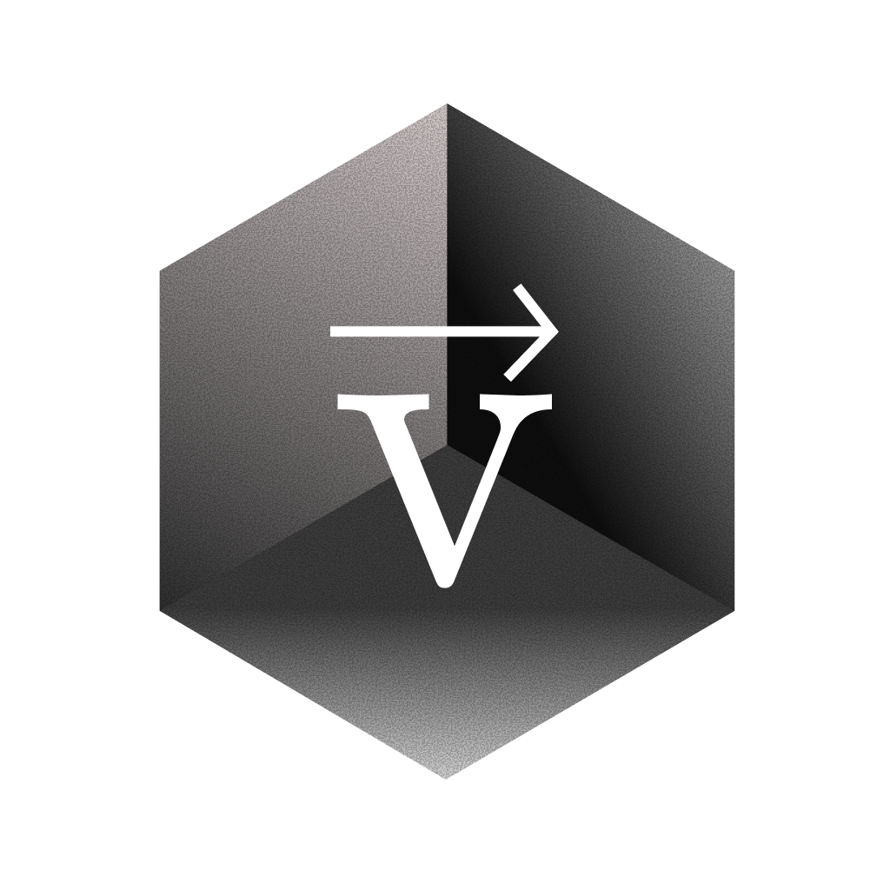

  

<h1 align="center">⚡ Velocity</h1>

  <strong>A blazingly fast, modern database management application</strong>

  
  
  

  
  
  
  

---

> [!CAUTION]
>
> ## ⛔ PROPRIETARY SOFTWARE - ALL RIGHTS RESERVED
>
> **This software is protected by copyright law and international treaties.**
>
> ❌ **Commercial use is STRICTLY PROHIBITED**  
> ❌ **Copying, forking, or cloning is PROHIBITED**  
> ❌ **Modification and distribution is PROHIBITED**  
> ❌ **Reverse engineering is PROHIBITED**  
> ❌ **AI/ML training on this code is PROHIBITED**
>
> **Violators will be prosecuted to the fullest extent of the law.**

---

> [!WARNING]
>
> ## 📋 LICENSE TERMS
>
> This repository and all its contents are the **exclusive property** of:
>
> **© 2024-2025 Sanz - All Rights Reserved**
>
> No license, express or implied, is granted to use, copy, modify, or distribute this software.
>
> 📧 **For licensing inquiries:** [sanztheopro@gmail.com](mailto:sanztheopro@gmail.com)

---

## 📖 About

**Velocity** is a cutting-edge database management application built with modern technologies for maximum performance and user experience.

### ✨ Features

- 🚀 **Blazingly Fast** - Powered by Rust backend
- 🎨 **Beautiful UI** - Modern React interface with dark mode
- 🗄️ **Multi-Database Support** - PostgreSQL, MySQL, SQLite
- 🤖 **AI-Powered** - Intelligent query assistance
- 🔒 **Secure** - Local-first architecture
- ⚡ **Native Performance** - Built with Tauri 2.0

### 🛠️ Tech Stack

| Layer        | Technology                        |
| ------------ | --------------------------------- |
| **Frontend** | React 18, TypeScript, TailwindCSS |
| **Backend**  | Rust, Tauri 2.0                   |
| **Database** | SQLite (local), PostgreSQL, MySQL |
| **AI**       | Multiple LLM providers            |

---

## 🔒 Intellectual Property Notice

<table>
<tr>
<td>

### ⚠️ IMPORTANT

This software represents significant intellectual property investment. All code, designs, algorithms, and documentation are protected under:

- **Copyright Law**
- **Trade Secret Protection**
- **International IP Treaties**

**Unauthorized use may result in:**

- Civil litigation for damages
- Criminal prosecution
- Injunctive relief
- Recovery of legal fees

</td>
</tr>
</table>

---

## 📬 Contact

<table>
<tr>
<td align="center" width="100%">

### For Commercial Licensing or Permissions

📧 **Email:** [sanztheopro@gmail.com](mailto:sanztheopro@gmail.com)

_All requests are reviewed at the author's sole discretion._

</td>
</tr>
</table>

---

## 📄 Full License

See the [LICENSE](./LICENSE) file for complete terms and conditions.

---

  
    <strong>© 2024-2025 Sanz. All Rights Reserved.</strong> 
    <em>Unauthorized reproduction or distribution is strictly prohibited.</em>
  

  

